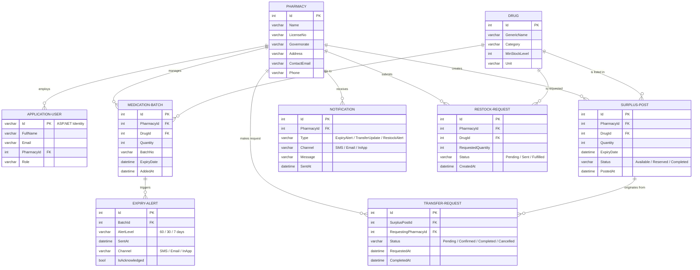

# MedTrack Jordan

**Medication Expiry & Shortage Tracker for Pharmacies**

Built with ASP.NET Core 8 | Orange Jordan Internship 2025 | SQL Server

---

## Table of Contents

- [Overview](#overview)
- [Features](#features)
- [Tech Stack](#tech-stack)
- [Project Structure](#project-structure)
- [Getting Started](#getting-started)
- [Database](#database)
- [Roles & Access](#roles--access)
- [Default Credentials](#default-credentials)
- [Roadmap](#roadmap)

---

## Overview

MedTrack Jordan is a web-based platform that solves a critical gap in Jordan's pharmaceutical supply chain — the complete absence of real-time inventory visibility between pharmacies, distributors, and the Ministry of Health (MOH).

Jordan imports over 90% of its medications. Pharmacies operate in silos: over-ordering drugs that expire unused while neighboring pharmacies face shortages of the same medications. MedTrack Jordan addresses this with three interconnected capabilities:

- **Smart inventory management** with automated expiry alerts at 60, 30, and 7-day thresholds
- **Peer-to-peer surplus sharing marketplace** between pharmacies
- **National shortage analytics dashboard** for MOH decision-makers

---

## Features

### Phase 1 — MVP (Current)
- [x] ASP.NET Core Identity with role-based access control
- [x] Pharmacy registration and management
- [x] Drug catalog with minimum stock level configuration
- [x] Medication batch tracking (quantity, batch number, expiry date)
- [x] Expiry alert engine (60 / 30 / 7 day thresholds)
- [x] Surplus post listings
- [x] Transfer request workflow between pharmacies
- [x] Notification audit log
- [x] Automatic restock request generation

### Phase 2 — Planned
- [ ] Background hosted service for nightly expiry scans
- [ ] SMS alerts via Twilio (Orange network routing)
- [ ] Email alerts via SendGrid
- [ ] MOH national analytics dashboard (Chart.js + Leaflet.js)
- [ ] CSV bulk stock import via CsvHelper
- [ ] Regional shortage detection algorithm
- [ ] Swagger API documentation

---

## Tech Stack

| Category        | Technology                    | Version  |
|-----------------|-------------------------------|----------|
| Framework       | ASP.NET Core MVC              | 8.0 LTS  |
| Language        | C#                            | 12       |
| ORM             | Entity Framework Core         | 8.x      |
| Database        | SQL Server / LocalDB          | 2022     |
| Authentication  | ASP.NET Core Identity         | 8.x      |
| Frontend        | Razor Views + Bootstrap       | 5.3      |
| Charts          | Chart.js                      | 4.x      |
| Maps            | Leaflet.js                    | 1.9      |
| SMS             | Twilio SDK                    | 7.x      |
| Email           | SendGrid                      | 9.x      |
| Testing         | xUnit + Moq                   | —        |

---

## Project Structure

```
MedTrackJordan/
│
├── Controllers/
│   ├── HomeController.cs
│   ├── AccountController.cs
│   ├── PharmacyController.cs
│   ├── DrugController.cs
│   ├── MedicationBatchController.cs
│   ├── SurplusPostController.cs
│   ├── TransferRequestController.cs
│   └── AdminController.cs
│
├── Models/
│   ├── ApplicationUser.cs
│   ├── Pharmacy.cs
│   ├── Drug.cs
│   ├── MedicationBatch.cs
│   ├── ExpiryAlert.cs
│   ├── SurplusPost.cs
│   ├── TransferRequest.cs
│   ├── Notification.cs
│   └── RestockRequest.cs
│
├── Data/
│   ├── ApplicationDbContext.cs
│   └── SeedData.cs
│
├── Views/
│   ├── Shared/
│   │   ├── _Layout.cshtml
│   │   └── _ValidationScriptsPartial.cshtml
│   ├── Home/
│   ├── Account/
│   ├── Pharmacy/
│   ├── Drug/
│   ├── MedicationBatch/
│   └── SurplusPost/
│
├── wwwroot/
│   ├── css/
│   ├── js/
│   └── lib/
│
├── appsettings.json
├── appsettings.Development.json
└── Program.cs
```

---

## Getting Started

### Prerequisites

- [.NET 8 SDK](https://dotnet.microsoft.com/download/dotnet/8.0)
- [SQL Server](https://www.microsoft.com/en-us/sql-server/sql-server-downloads) or SQL Server LocalDB (included with Visual Studio)
- [Visual Studio 2022](https://visualstudio.microsoft.com/) or [VS Code](https://code.visualstudio.com/)

### Installation

1. **Clone the repository**
   ```bash
   git clone https://github.com/your-username/MedTrackJordan.git
   cd MedTrackJordan
   ```

2. **Restore dependencies**
   ```bash
   dotnet restore
   ```

3. **Configure the connection string**

   Open `appsettings.json` and update `DefaultConnection` if needed:
   ```json
   "ConnectionStrings": {
     "DefaultConnection": "Server=(localdb)\\mssqllocaldb;Database=MedTrackJordanDb;Trusted_Connection=True;"
   }
   ```

4. **Apply migrations**
   ```bash
   dotnet ef database update
   ```
   Or in Visual Studio Package Manager Console:
   ```
   Update-Database
   ```

5. **Run the project**
   ```bash
   dotnet run
   ```
   Or press **F5** in Visual Studio.

6. **Open in browser**
   ```
   https://localhost:7000
   ```

---

## Database

### Running Migrations

```bash
# Create a new migration
dotnet ef migrations add MigrationName

# Apply all pending migrations
dotnet ef database update

# Revert last migration
dotnet ef migrations remove

# Drop and recreate the database
dotnet ef database drop
dotnet ef database update
```

### Entity Overview

| Entity            | Description                                              |
|-------------------|----------------------------------------------------------|
| Pharmacy          | Registered pharmacy with license and governorate info    |
| Drug              | Medication catalog with minimum stock configuration      |
| ApplicationUser   | Identity user linked to a pharmacy                       |
| MedicationBatch   | Stock entry with quantity, batch number, and expiry date |
| ExpiryAlert       | Auto-generated alert at 60 / 30 / 7 day thresholds      |
| SurplusPost       | Pharmacy listing excess stock for sharing                |
| TransferRequest   | Request from one pharmacy to claim a surplus post        |
| Notification      | Audit log for all sent alerts (SMS, Email, InApp)        |
| RestockRequest    | Auto-generated request when stock drops below minimum    |

---

## Roles & Access

| Role             | Access Level                  | Key Capabilities                                              |
|------------------|-------------------------------|---------------------------------------------------------------|
| Admin            | Full system access            | Manage all data, users, roles, system settings               |
| PharmacyManager  | Own pharmacy + reports        | Configure thresholds, view waste reports, manage staff        |
| PharmacyStaff    | Own pharmacy data only        | Log stock, view alerts, browse surplus board, request transfers|
| Distributor      | Restock requests only         | View aggregated demand by region, confirm deliveries          |
| MOHAdmin         | Read-only national view       | National analytics dashboard, export reports, shortage alerts |

---

## Default Credentials

> ⚠️ Change these immediately after first login in any non-development environment.

| Role  | Email                  | Password    |
|-------|------------------------|-------------|
| Admin | admin@medtrack.jo      | Admin@12345 |

---

## Roadmap

| Phase   | Weeks  | Deliverables                                                      |
|---------|--------|-------------------------------------------------------------------|
| Phase 1 | 1–2    | Project scaffold, Identity auth, role-based login                 |
| Phase 2 | 3–4    | MedicationBatch CRUD, CSV import, color-coded dashboard           |
| Phase 3 | 5–6    | IHostedService background job, expiry alert engine, SMS + Email   |
| Phase 4 | 7–8    | SurplusPost CRUD, TransferRequest workflow, proximity sorting      |
| Phase 5 | 9–10   | MOH dashboard, Chart.js visualizations, Leaflet.js shortage map   |
| Phase 6 | 11–12  | xUnit tests, Swagger docs, Azure / IIS deployment                 |

---

## ERD Diagram


---

*MedTrack Jordan | Orange Internship 2025 | Built with ASP.NET Core 8*
